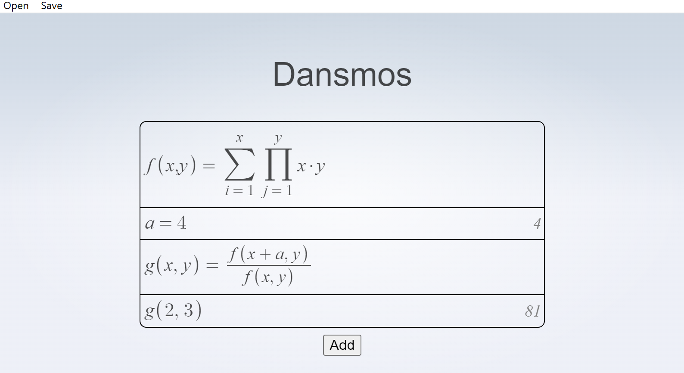

# Dansmos!

Daniel's Desmos. 
Available for [Windows](dist/dansmos_0.1.0_x64-setup.exe) and [Mac](dist/dansmos_0.1.0_x64_en-US.msi)

## Features
- Variables
- Multivariables functions
- SI unit calculations
- Save and load latex files

## Features to be added
- [ ] Complex Numbers
- [ ] Plotting
- [ ] Differential equations
